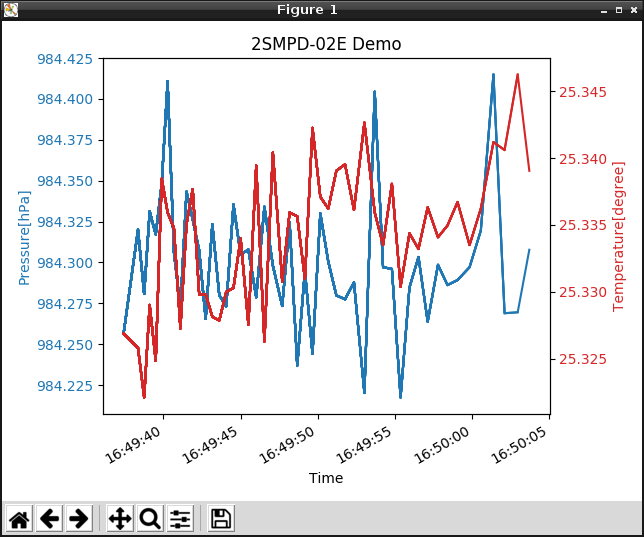

# 2smpb02e-grove-raspberrypi
オムロン製センサ 2SMPB-02E を Raspberry Pi 3 Model B で評価する為のモジュールと、モジュールを利用する場合のサンプルプログラムです。  

2SMPB-02E は高精度・低消費電流の小型MEMS絶対圧センサです。  
低ノイズの24bit ADCを内蔵し、気圧を高精度に測定することができます。  
制御と出力は I2C/SPI インターフェースを通じたデジタル方式で、自動スリープモードによる低消費電流を実現しています。

## 言語
- [英語](./README.md)
- [日本語](./README_ja.md)

## 概要
- grove_2smpb_02e.py  
2SMPB-02E から GrovePi+ 経由でデータを取得するためのドライバモジュールです。

- sample_2smpb_02e.py  
ドライバモジュール経由で取得したデータをコンソール上で確認できるサンプルプログラムです。

- sample_gui_2smpb_02e.py  
ドライバモジュール経由で取得したデータをグラフで可視化して確認できるサンプルプログラムです。

***デモ:***  
sample_gui_2smpb_02e.py を実行すると以下のようなグラフを確認することができます。  



## インストール方法
1. 事前に依存関係のあるソフトウェアをインストールして下さい。  
    [依存関係](#link)
2. ターミナルを開き、次のコマンドを実行します。  
    ```
    $ mkdir omron_sensor
    $ git clone https://github.com/omron-devhub/2smpb02e-grove-raspberrypi.git
    ```

## 使い方
サンプルプログラムを動作させる手順です。

-  sample_2smpb_02e.py  
ターミナルを開き、次のコマンドを実行します。  
    ```
    $ cd omron_sensor
    $ sudo python3 sample_2smpb_02e.py
    ```
- sample_gui_2smpb_02e.py  
ターミナルを開き、次のコマンドを実行します。  
    ```
    $ cd omron_sensor
    $ sudo python3 sample_gui_2smpb_02e.py
    ```

## <a name="link"></a>依存関係
2smpb02e-grove-raspberrypi には次に挙げるソフトウェアとの依存関係があります。
- [Python3](https://www.python.org/)
- [GrovePi+](http://wiki.seeedstudio.com/GrovePi_Plus/)
- [matplotlib](https://matplotlib.org/)
- [smbus2](https://pypi.org/project/smbus2/)

## ライセンス
Copyright (c) OMRON Corporation. All rights reserved.

このリポジトリはMITライセンスの下でライセンスされています。
